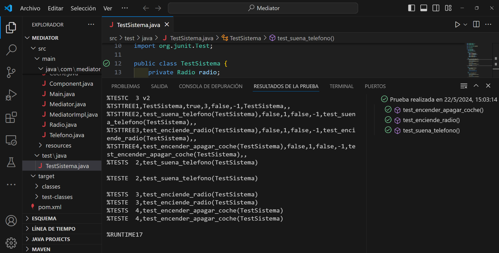

## Patrón Meditor

Mediator es un patrón de diseño de comportamiento que permite reducir las dependencias entre los componentes de un programa al obligarlos a comunicarse únicamente a través de un objeto mediador.

En este ejemplo, el mediador es un objeto que se encarga de gestionar la comunicación entre varios objetos de la aplicación. Los objetos solo conocen al mediador y no se comunican directamente entre ellos. Esto permite desacoplar los objetos y reutilizarlos en otros contextos.

Madiator es una interfaz que define los métodos de comunicación entre los objetos. MediatorImpl es una implementación concreta de la interfaz Mediator que se encarga de gestionar la comunicación entre los objetos. Component es una clase que representa un objeto de la aplicación que debe comunicarse con otros objetos. Finalmente, Coche, Telefono y Radio heredan de Component y son clases concretas que se comunican a través del mediador.

## Resultado de los test
