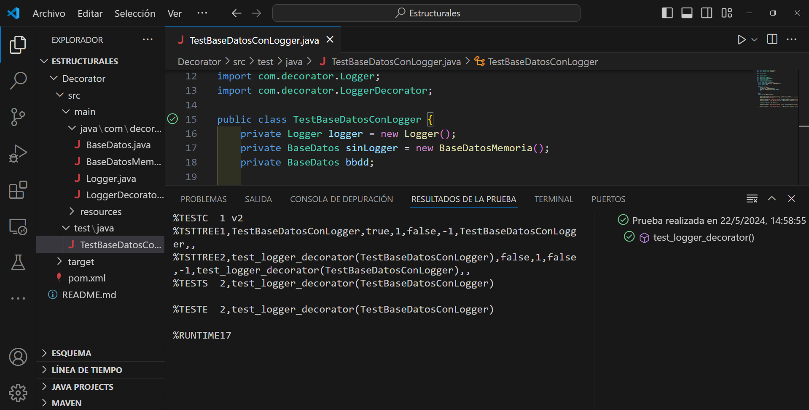

## Patrón Decorator

Decorator es un patrón de diseño estructural que permite añadir nuevos comportamientos a objetos existentes de forma dinámica y sin necesidad de modificar su código fuente.

En este ejemplo, se busca poder "enriquecer" el comportamiento de nuestra clase existente (BaseDatosMemoria) sin modificar ni una línea de su código fuente.

BaseDatos es una interfaz que define las funciones que se espera que la base de datos pueda realizar. BaseDatosMemoria es una implementación de esta interfaz que guarda los registros. Logger es una clase que se encarga de registrar los eventos que ocurren en la base de datos. LoggerDecorator es una clase que implementa la interfaz BaseDatos y que recibe una instancia de BaseDatos y un Logger. Esta clase se encarga de llamar a los métodos de la base de datos y a su vez, registrar los eventos en el Logger.

# Resultado de la ejecución del test
